# IDA Cryptographic finder extension dokumentace

## Uvod

Tento dokument obsahuje veškeré informace a dokumentaci ohledně zápočtového programu předmětu Programování 2. Dokument nejdříve pojednává o formalizaci problému, jeho popisu a teoretickému přístupu. Následně bod po bodu prochází vytvořený kód. Na závěr dokument pojednává o místech na zlepšení a potenciální budoucnosti programu.  

## Formalizace programu

Výsledný program by měl být plug-in do disassembleru [IDA Pro](https://hex-rays.com/ida-pro/). IDA pro vystavuje [python API](https://hex-rays.com/products/ida/support/idapython_docs/) se kterým je možné do IDA pro nahrát tzv. pluginy. Přes toto API má python program následně přístup k interakci se samotným dekompilovanym kodem/instrukcemi.

Pomocí výše zmíněného API, IDA umožňuje prohlížení kódů v takzvaném “flow chart” módu, kde zobrazí instrukce dekompilovaneho kódu ve grafech různých execution flow, kterými může kód běžet (větvení if statementu, volání funkcí apod.). Ukázka jak může vypadat tento flowchart: 

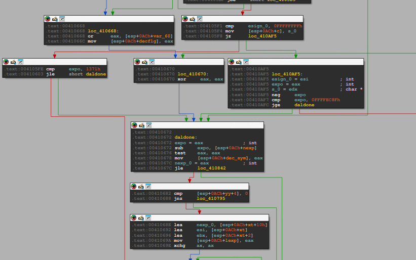{width=60%}

Výsledný program bude prohledávat (nejen) tyto flowcharty a počítat instrukce z předem určeného seznamu, které mohou být použité v kryptografických algoritmech (opakovaný xor, add, shift apod.). 

Finální algoritmus problému bude tedy pro daný dekompilovany kód prohledat všechny tyto flow charty. Tedy prohledat grafy všech flowchartu. (Abych byl korektní, tak pro každý pointer funkce který IDA API vrátí v daném dekompilovanem kódu prohledat jeho graf flowchartu).

V každém tomto podgrafu bude cílem najít frekvenci těchto instrukcí a vrátit jako výstup blok ve flowchartu kde je těchto instrukcí nejvíce.

Cílem programu bude urychlit process reverse engineeringu větších binárních souborů a redukovat nutnost procházet velké množství funkcí manuálně. Při hledání potenciálních kandidátů které slouží jako šifrovací funkce, ať standartnich algoritmu nebo jakýchkoliv custom šifrám. Manuální ověření bude pořád nutné, nicméně tento program má za cíl z možných stovek či tisíců funkci toto množství o řád či dva zmenšit. 

## Teoreticky popis reseni problemu

Pro nalezení optimálních bloku a frekcenci jsem se rozhodl řešení rozdělit na tři casti. První část, které prohledá výše zmíněné flowchary, identifikuje zacyklené části těchto grafů a spočítá v nich frekvenci instrukcí. Druhá část, která pouze instrukci po instrukci projede dekompilovany kód a najde bloky v binárním souboru a nalezne frekvence námi hledaných instrukci pouze v těchto blocích. Tyto bloky vůbec nemusí ve spuštění programu být za sebou, jsou pouze seřazeny od nejmenší virtuální adresy v programu po největší.

Finální fáze programu vyfiltruje output z obou předchozích casti a pokusí se nalezené bloky spojit či smazat, pokud na sebe budou navazovat či nikoliv. 

### Prvni faze 

Po načtení binárního souboru do IDA pro, lze pomocí IDA Api získat seznam všech funkcí v něm. První fáze programu bude iterovat přes všechny tyto funkce a jejich flowchart. Pro každý tento flowchart provede tzv. Tarjanuv algoritmus. Vstup toho algoritmu je orientovany graf, v našem případě flowchart funkce. Výstup toho algoritmu jsou silně souvislé komponenty vstupního grafu. Jelikož se jedná o orientovany graf, budou jeho silně souvislé komponenty jeho cykly. Nás budou zajímat cykly délky větší než 1. 

Popis tohoto algoritmu lze najít [zde](https://en.wikipedia.org/wiki/Tarjan%27s_strongly_connected_components_algorithm), jeho nasledna ukázková implementace poté [zde](https://www.geeksforgeeks.org/tarjan-algorithm-find-strongly-connected-components/). 

Následně po nalezení všech cyklů ve flowchartu, spočítá program frekvenci námi hledaných instrukcí v každém z nich a vrátí jejich slovník.

### Druha faze 

Druhá fáze programu bude opět iterovat přes všechny funkce v binárním souboru. V této fázi se zavede Fronta předem určené délky. Následně program bude iterovat přes všechny instrukce v dané funkci (od nejmenší virtuální adresy po největší). Tato iterace bude pomocí této fronty. Při iteraci se pomocí fronty vždy jedna instrukce do ní přidá a jedna odebere. Při celé této iteraci se bude počítat počet námi preddefinovanych hledaných instrukcí v této frontě. 

Bloky s největším počtem těchto instrukcí se budou společně s jejich frekvencemi ukládat do slovníku.

### Treti faze 

Ve třetí fázi program vezme oba slovniky z prvních dvou částí a zpracuje je. Nejdříve program bude iterovat přes nalezené silně souvislé komponenty. Pro každou z těchto souvislých komponent bude program prohledavat druhý slovník z druhé fáze a jeho bloky.

Budou nás zajímat 3 situace které mohou nastat:

1. Blok ze slovníku z druhé fáze je celý obsažen v jakémkoliv bloku v silne komponentě grafu
2. Blok ze slovníku z druhé fáze přímo začíná v jakémkoliv bloku v silne komponentě grafu ale končí jinde
3. Blok ze slovníku z druhé fáze přímo končí v jakémkoliv bloku v silne komponentě grafu ale začíná jinde

V prvni situaci program blok z druhého slovníku vymaže. Ve druhé situaci rozšíří bloky z prvního slovníku o část bloku z druhého slovníku která "přečuhuje ven". Ve třetí situaci rozšíří bloky z prvního slovníku o část bloku z druhého slovníku která "začíná před ním"

Finálně program bude iterovat pres zbylé nalezené bloky z první fáze a spojí dohromady ty bloky, které jsou příliš blízko u sebe a nebo ty které jsou ve stejném bloku flowchartu ve kterém se nalezený blok nachází. 

Bloky které zbyly, program vypíše do standartniho outputu v tabulce která bude obsahovat začáteční a koncovou adresu bloku, jméno funkce v binárním souboru kde se nachází, frekvenci "kryptografických instrukcí" a z jaké fáze hledání blok pochází.

## Technicka Dokumentace kodu

Tato kapitola prochází části kódu ve stejném pořadí jako kapitoly v teoretickém popisu problému a soustavně vysvětluje jejich technické provedení v kontextu řešení tohoto problému. 

### IDA Plugin

První krok programu je pomoci potřebných IDA API funkcí se nahrát jako plugin do IDA Pro.

Toto je docíleno za pomoci funkce ```PLUGIN_ENTRY()```, která je podle dokumentace [vstupní bod to pluginu](https://hex-rays.com/blog/scriptable-plugins/). Tato funkce musí vrátit třídu vracející objekt  [plugin_t](https://hex-rays.com/blog/scriptable-plugins/). V mém případě jo toto třída ```CryptoFinderWrapper```.

Tato trida musí definovat tři funkce, ```init(), run(), term()``` které jsou použité pro registraci pluginu a jeho funkcí, spuštění funkci pluginu a poté jeho následné ukončení.

```python
class CryptoFinderWrapper(idaapi.plugin_t):
    """
    Main Plugin class
    """
    
    flags = idaapi.PLUGIN_KEEP

    # Naming of the plugin
    action_name = "cf:search"
    comment = 'Cryptographic Finder'
    help = ""
    menu_name = "Find cryptographic instructions"
    wanted_name = "Cryptographic Finder"
    wanted_hotkey = ''
    root_tab = 'Search'

    # registering button as Ctrl+Shift+3 and action in the menu
    def init(self):
        print('CryptoFinderWrapper init')
        action = idaapi.action_desc_t(self.action_name,
                                            self.menu_name,
                                            CryptoFinderHandler(),
                                            'Ctrl-Shift-3',
                                            "",
                                            -1)
        idaapi.register_action(action)
        idaapi.attach_action_to_menu(self.root_tab,self.action_name, idaapi.SETMENU_APP)

        return idaapi.PLUGIN_KEEP

    def run(self, arg):
        global Finder
        Finder = CryptoFinder()
        pass

    def term(self):
        idaapi.unregister_action(self.action_name)
        pass


def PLUGIN_ENTRY():
    return CryptoFinderWrapper()
```

Funkce ```init()``` pomocí [idaapi.action_desc_t](https://hex-rays.com//products/ida/support/idapython_docs/ida_kernwin.html#ida_kernwin.action_desc_t) zaregistruje klávesovou zkratku ```Ctrl + Shift + 3``` na své spuštění. Následně pomocí [register_action](register_action) a [attach_action_to_menu](https://hex-rays.com//products/ida/support/idapython_docs/ida_kernwin.html#ida_kernwin.register_action) přidá tlačítko do menu IDA pro které taktéž vyvolá spuštění pluginu. 

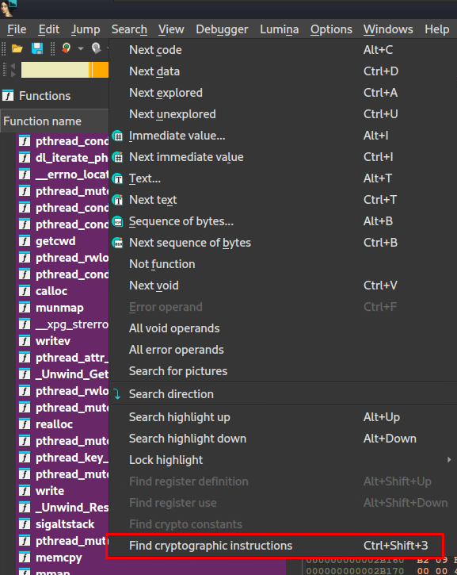{ width=40% }

Funkce ```run()``` už samotná spouští hlavní třídu pluginu ```CryptoFinder``` ve které se vyskytuje jeho hlavní implementace. 

Funkce ```term()``` definuje co se má stát při terminaci procesu IDA Pro, v našem případě se plugin pouze smaže pomocí [unregister_action](https://hex-rays.com//products/ida/support/idapython_docs/ida_kernwin.html#ida_kernwin.unregister_action)

Poznámka: Třídy ve funkci ```run()``` a ```action_desc_t()``` jsou jiné. To je z důvodu že tlačítko v menu IDA pro musí vracet Třídu která vrací objekt typu [action_handler_t](https://hex-rays.com//products/ida/support/idapython_docs/ida_kernwin.html#ida_kernwin.action_handler_t). Je proto tedy volání z tlačítka "zabalené" do třídy ```CryptoFinderHandler``` která tento objekt vrací a teprve spousti hlavní implementaci pluginu ```CryptoFinder```.

### Prvni faze

Seznam instrukcí které nás v dalších částech budou zajímat je pro zatím následující:

```python
instruction_list = [ida_allins.NN_xor,
                        ida_allins.NN_sal, # Shift Arithmetic Left
                        ida_allins.NN_sar, # Shift Arithmetic Right
                        ida_allins.NN_shl, # Shift Arithmetic Left
                        ida_allins.NN_shr, # Shift Logical Right
                        ida_allins.NN_rol, # Rotate Left
                        ida_allins.NN_ror, # Rotate Right
                        ida_allins.NN_add, # Add
                        ida_allins.NN_adc, # Add with Carry
                        ida_allins.NN_rcl, # Rotate Through Carry Left
                        ida_allins.NN_rcr] # Rotate Through Carry Left
```

Tyto instrukce jsou z intel x86 architektury, konstanty v listu ```instruction_list``` jsou zavedené v [ida_allins](https://hex-rays.com//products/ida/support/idapython_docs/ida_allins.html) API, těmito konstantami IDA rozlišuje jednotlivé instrukce mezi sebou. Toto API nese konstanty instrukcí napříč všemi architekturami. Instrukce v ```instruction_list```  budu referovat v dalších částech jako hledané "kryptografické instrukce" i když to jsou standartni "general purpose" instrukce, toto bude z důvodu přehlednosti.

Hlavní Třídou pluginu je třída ```CryptoFinder```, která spouští funkci ```Traverse()```. V této funkci je nejdříve iterováno přes všechno funkce v momentalne prohlíženém binárním souboru. Toto je učiněno za pomocí funkce [idautils.Functions()](https://hex-rays.com//products/ida/support/idapython_docs/idautils.html#idautils.Functions) která vrací list adres těchto funkcí. Následně pomocí [ida_funcs.get_func](https://hex-rays.com//products/ida/support/idapython_docs/ida_funcs.html#ida_funcs.getn_func) se získá objekt funkce IDA pro. Z tohoto objektu lze poté získat graf flowchartu této funkce pomocí [idaapi.FlowChart](https://hex-rays.com//products/ida/support/idapython_docs/ida_gdl.html#ida_gdl.FlowChart).

```python
# iterating through all functions returned by ida
for function_eaddr in idautils.Functions():
    funct_t = ida_funcs.get_func(function_eaddr)

    flow_chart = idaapi.FlowChart(ida_funcs.get_func(function_eaddr))

    first_block = flow_chart[0]
```

Následně se extrahuje jeho první blok (kořen grafu) a začne se tento graf prohledávat pomocí Tarjanova algoritmu. Tyto bloky jsou popsané třídou [BasicBlock](https://hex-rays.com//products/ida/support/idapython_docs/ida_gdl.html#ida_gdl.BasicBlock). Nesou v sobě informaci o své začáteční a koncové adrese v binárním souboru, a seznamy svých předchůdců a následovníků.

V této fázi se inicializují promenne na Tarjanuv algoritmus.

```python
colors = [0] * flow_chart.size
parents = [0] * flow_chart.size

global cyclenumber
cyclenumber = 0

#Identifying loops in graph and output themting
SCC = tarjan(flow_chart)
# only taking loops of size > 1
non_trivial_loops = [component for component in SCC if len(component) > 1]
```

Tento algoritmus pomocí listů ```low``` a ```disc``` postupně obarví všechny vrcholy grafu na jednotlivé silně souvislé komponenty. Každý blok a jeho všichni následovníci jsou rekurzivně prohledáni funkci ```SCC_for_current_vertex```. Tato funkce najde komponentu souvislosti pro daný vstupní vrchol, buď založí novou v listu ```result``` a nebo tento vrchol přidá do už existující komponenty. Kompletní popis algoritmu je k nalezení [zde](https://en.wikipedia.org/wiki/Tarjan%27s_strongly_connected_components_algorithm) a [zde](https://www.geeksforgeeks.org/tarjan-algorithm-find-strongly-connected-components/). 

```python
def tarjan(flow_chart):
    """
    Function which performs Tarjans alrogithm on a graph

    @flow_chart - root node of IDA Flowchart graph

    Returns array of strongly connected components of graph pointed by flow_chart
    """
    global result, stack, low, disc , index_counter, stackMember
    index_counter = [0]
    stack = []
    # Coloring arrays
    low = [-1] * flow_chart.size
    disc  = [-1] * flow_chart.size
    stackMember = [False] * (flow_chart.size)
    
    result = []
    # Iterating through all block and calculating its strongly connected component
    for block in flow_chart:
        if disc[block.id] == -1:
            SCC_for_current_vertex(block)
```

Po skončení algoritmu, vyfiltrujeme triviální cykly velikost 1. Poté v každé komponentě souvislosti spočítáme frekvenci námi zadefinovanych instrukcí. Bloky v komponentech jsou také vybarveny zelene, pro debugovaci a demonstrativní účely.

```python
# saving all non trivial loops to global array

for loop in non_trivial_loops:
    all_non_trivial_loops.append(loop)

# color loops (SCC)
for loop in non_trivial_loops:
    for block in loop:
        set_color(block.start_ea, 1, 0x00FF00)

# Counting crypto instruction in each block in the loop

for non_trivial_loop in non_trivial_loops:
    hashmap_of_frequency[non_trivial_loop[0].start_ea] = count_in_loop(non_trivial_loop)
```

Frekvence instrukcí v komponentě je spočítána funkci ```count_in_loop```. Která iteruje přes všechny bloky v této komponentě a jejich adresy. Následně dekompiluje instrukce pomocí funkce [decode_insn](https://hex-rays.com//products/ida/support/idapython_docs/ida_ua.html#ida_ua.decode_insn) a porovnává zda je tato instrukce v seznamu námi hledaných instrukcí či nikoliv. Finální výsledek je uložen do slovníku ```hashmap_of_frequency```, který uchovává frekvence a komponenty souvislosti s danými frekvencemi.

```python
def count_in_loop(loop):
    """
    Functions that counts crypto instructions in loop (SCC component)

    @loop - list of BasicBlocks which is a strongly connected component from Tarjans algorithm

    Returns the number of instructions between start_ea and end_ea of all BasicBlocks in loop
    """
    counter = 0
    for block in loop:
        # loop through all instruciton addresses in block
        for eaddr in idautils.Heads(block.start_ea, block.end_ea):
            # disassembling the address
            insn = idaapi.insn_t()
            length = idaapi.decode_insn(insn, eaddr)
            # searching for instructions
            if insn.itype in instruction_list:
                counter += 1
    return counter
```

Toto je konec První fáze.

### Druha faze

Druhá fáze je implementována za pomoci funkce ```density_search()```.

Tato funkce opět iteruje přes všechny funkce v binárním souboru pomocí [idautils.Functions()](https://hex-rays.com//products/ida/support/idapython_docs/idautils.html#idautils.Functions) a [ida_funcs.get_func](https://hex-rays.com//products/ida/support/idapython_docs/ida_funcs.html#ida_funcs.getn_func). 

```python
    # Iterating through all functions returned from IDA
    for function_eaddr in idautils.Functions():
        funct_t = ida_funcs.get_func(function_eaddr)
```

Následně pro každou funkci budeme iterovat přes všechny adresy v ní. Každou adresu opet dekompilujeme pomocí [decode_insn](https://hex-rays.com//products/ida/support/idapython_docs/ida_ua.html#ida_ua.decode_insn). Nyní tedy iterujeme už přes instrukce ve funkci.

Každou instrukci přidáme na konec fronty o maximální velikost 30 instrukcí. Zároveň z fronty odebereme první instrukci v ní. Takto procházíme blok o velikost 30 instrukcí najednou. Pro každou přidanou instrukci do fronty kontrolujeme zda se nenachází v námi hledaném seznamu "kryptografických instrukcí". Pokud ano, inkrementujeme proměnou ```counter```. Pokud je naopak odebírána instrukce z fronty v seznamu "kryptografických instrukcí", ```counter``` snížíme. 

Tímto způsobem funkce ```density_search``` projede všechny adresy funkce a uchová bloky o velikosti 30 s největšími počty frekvencí ve slovníku ```chunk_max_addr_dict```. Následně tento slovník poté vrátí.

```python
# iterating trhough all instructions in the function, disassembling them
for eaddr in idautils.Heads(funct_t.start_ea, funct_t.end_ea):
    insn = idaapi.insn_t()
    length = idaapi.decode_insn(insn, eaddr)
    # Filling a queue
    if not q.full():
        q.put(insn)
        if insn.itype in instruction_list:
            counter += 1
    else:
        currently_dequed = q.get()
        # removed instruction is in the instruction_list
        if currently_dequed.itype in instruction_list:
            counter -= 1
        q.put(insn)
        # placing new instruction to the queue and checking whether it is in instruction_list
        if insn.itype in instruction_list:
            counter += 1
            # saving a max chunk where the maximum number of "cryptographic" instructions were found
            if counter >= max_counter:
                max_counter = counter
                chunk_max_addr = [q.queue[0].ea, q.queue[29].ea]
                # Storing in dictionary, first checking if the key exists, if not, creating it
                if max_counter not in chunk_max_addr_dict.keys():
                    chunk_max_addr_dict[max_counter] = [[q.queue[0].ea, q.queue[29].ea]]
                else:
                    chunk_max_addr_dict[max_counter].append([q.queue[0].ea, q.queue[29].ea])
      
```

### Treti faze

Třetí fáze je implementována pomocí funkcí ```find_overlap``` a ```filtering_results```. První z nich,  ```find_overlap``` jako vstup vezme slovníky ```all_non_trivial_loops, density_search_dict``` z prvních dvou fází a vyfiltruje následující tři situace.

1. Blok ze slovníku ```density_search_dict``` z druhé fáze je celý obsažen v jakémkoliv bloku v silne komponentě grafu ve slovníku ```all_non_trivial_loops```
2. Blok ze slovníku ```density_search_dict``` z druhé fáze přímo začíná v jakémkoliv bloku v silne komponentě grafu ve slovníku ```all_non_trivial_loops``` ale končí v jiném bloku 
3. Blok ze slovníku ```density_search_dict``` z druhé fáze přímo končí v jakémkoliv bloku v silne komponentě grafu ve slovníku ```all_non_trivial_loops``` ale začíná v jiném bloku

První situace je vyřešena funkce ```delete_fully_overlapping```. Která iteruje přes všechny kombinace bloků z obou fází. Toto je bohužel implementováno přes vnořené cykly, jelikož každý slovník uchovává v sobě listy bloku. 

Jakmile se najde blok z druhé fáze který je celý obsažený v bloku z první fáze, je vymazán.

```python
        if address[0] > block.start_ea and address[1] < block.end_ea:
            # deleting the block
            density_search_dict[density].remove(address)
```

Tato funkce je volána ve while loopu abychom se vyhnuli mazání objektů ve slovníku přes který iterujeme. 

``` python
    while delete_fully_overlapping(non_trivial_loops, density_search_dict):
        pass
```

Druhá situace je opět vyřešena přes iteraci všech kombinací bloku ze slovníku obou fází. Pokud je počáteční adresa bloku z druhé fáze ```address[0]``` v jakémkoliv bloku sile komponenty z první fáze, načte se seznam následovníků tohoto bloku. Pokud Je koncová adresa bloku z druhé fáze (```address[1]```) v jednom z těchto bloků (nicméně nemusí být nutně v silne komponentě), spočítá se zda jsou v tomto rozdílu nějaké hledané "kryptografické instrukce". Pokud ano, vytvoří se nový blok spojený z těchto bloků a uloží se. 


```python
# continuing to second and third situation
# Double looping through all possible combinations of blocks from both searches
merged_blocks = {}
for density, blocks in density_search_dict.items():
    for address in blocks:

        for non_trivial_loop in non_trivial_loops:
            for block in non_trivial_loop:
        
                # second situation
                if address_in_block(address[0], block):
                    # appending the block (only if the address[1] is in blocks successors>)
                    for successor in block.succs():
                        if address_in_block(address[1],successor):

                            # only appending if there are more crypto instruction in their overlap, if not, ignore
                            difference = count_in_block(block.end_ea, address[1])
                            if difference > 0:
                                # merging
                                new_block = [block.start_ea, address[1]]
                                count_in_new_block = count_in_block(new_block[0], new_block[1])
                                # Storing in dictionary, first checking if the key exists, if not, creating it
                                if count_in_new_block not in merged_blocks.keys():
                                    merged_blocks[count_in_new_block] = [new_block]
                                else:
                                    merged_blocks[count_in_new_block].append(new_block)
```

Třetí situace je vyřešená obdobně. Ve stejné iteraci přes všechny kombinace bloků z obou fází se zkontroluje zda koncová adresa bloku z druhé fáze (```address[1]```) není v jakemkoliv bloku v silne komponentě z fáze první. Pokud ano, načtou se všichni předchůdci tohoto bloku. Pokud je počáteční adresa bloku z druhé fáze v jednou z těchto predchudcu, spočítá se zda jsou v tomto rozdílu nějaké hledané "kryptografické instrukce". Pokud ano, vytvoří se nový blok spojený z těchto bloků a uloží se. 


```python
# third situation
elif address_in_block(address[1], block):
    # prepending the block (only if the address[1] is in blocks predecessors>)
    for predecessor in block.preds():
        if address_in_block(address[0],predecessor) :

            # only prepending if there are more crypto instructions in their overlap, if not, ignore
            difference = count_in_block(address[0], block.start_ea)
            if difference > 0:
                # merging
                new_block = [address[0], block.end_ea]
                count_in_new_block = count_in_block(new_block[0], new_block[1])
                # Storing in dictionary, first checking if the key exists, if not, creating it
                if count_in_new_block not in merged_blocks.keys():
                    merged_blocks[count_in_new_block] = [new_block]
                else:
                    merged_blocks[count_in_new_block].append(new_block)
```

Nakonec funkce ```find_overlap``` vrátí list těchto nových spojenych bloku.

Pro zpřehlednění kódu byla na zjištění zda se adresa nachází v bloku použita pomocná funkce ```address_in_block```, která bere jako parametr adresu a blok. Následně vrátí boolean či je tato adresa v tomto bloku či nikoliv.

```python
def address_in_block(address, block):
    """
    Function which returs boolean whether the address is in the basic block pointed by block

    @address - adress to search 
    @block - BasicBlock where address will be searched
    """
    if address > block.start_ea and address < block.end_ea:
        return 1
    return 0
```

Druhá z hlavních funkcí třetí fáze, ```filtering results```, bere jako vstup pouze slovník z druhé fáze. Iteruje přes všechny bloky v něm, a pro kazdy tento blok se vrátí na začátek [FlowChart](https://hex-rays.com//products/ida/support/idapython_docs/ida_gdl.html#ida_gdl.FlowChart) grafu funkce v binárním souboru ve kterém se tento blok nachází; a najde jeho příslušný BasicBlock v tomto grafu. Pro daný blok z druhé fáze (který má délku 30 instrukcí) je tedy nalezen Blok ve FlowCHart grafu funkce ve kterém se nachází (tento blok může být delší).

```python
# Looping throuhg all blocks from density search and its addresses with i instructions
for density, blocks in density_search_dict.items():
    for address in blocks:
        # disassembling the instructions
        function_address = ida_funcs.get_func(address[0])
        flow_chart = idaapi.FlowChart(function_address)

        for block in flow_chart:
            # finding a block in flow chart where the block from density search is 
            if address[0] > block.start_ea and address[1] < block.end_ea:
```

Následně zkontroluje zda v tomto BasicBlocku nejsou ostatní bloky nalezené v druhé fázi. Pokud ano, bloky z druhé fáze jsou blízko sebe a mohou být sloučeny. Jsou tedy tyto dva bloky vymazány a je vytvořen nový blok který je vrácen zpátky do listů.

```python
# found the block in flowchart
# loop through the rest of the blocks from density search and identify if any of them is in the 
# same flowchart block as well, if yes, merge them and delete them
for density_2, blocks_2 in density_search_dict.items():
    for address_2 in blocks_2:

        if address_2 == address:
            continue
        elif address_2[0] > block.start_ea and address_2[1] < block.end_ea:
            # merge and delete address_2 block
            if address_2[0] > address[0]:
                # new block is [address[0], address_2[1]]
                new_block = [address[0], address_2[1]]
            else:
                # new block is [address_2[0], address[1]]
                new_block = [address_2[0], address[1]]

            # recount crypto instruction in the new block
            count_in_new_block = count_in_block(new_block[0], new_block[1])

            # putting new block into the array and deleting the old one
            density_search_dict[density].remove(address)
            density_search_dict[density_2].remove(address_2)
            # Storing in dictionary, first checking if the key exists, if not, creating it
            if count_in_new_block not in density_search_dict.keys():
                density_search_dict[count_in_new_block] = [new_block]
            else:
                density_search_dict[count_in_new_block].append(new_block)
            return 1
```

V tomto novém bloku musí být přepočítány "kryptografické instrukce". Toto je implementováno pomocí funkce ```count_in_block```, které bere jako parametry 2 adresy, začáteční a koncovou, načte všechny instrukce mezi nimi a spočítá (Opět pomocí [decode_insn](https://hex-rays.com//products/ida/support/idapython_docs/ida_ua.html#ida_ua.decode_insn)) kolik z nich je v našem seznamu "kryptografických instrukcí".


```python
def count_in_block(start_ea, end_ea):
    """
    Function that counts crypto instructions in block specified by start address and end address

    @start_ea - start address of block to search
    @end_ea   - send address of block to search

    Returns the number of instructions between start_ea and end_ea
    """
    counter = 0
    # loop through all instruciton addresses beteen start_ea and end_ea
    for eaddr in idautils.Heads(start_ea, end_ea):
        # disassembling the address
        insn = idaapi.insn_t()
        length = idaapi.decode_insn(insn, eaddr)
        # searching for instructions
        if insn.itype in instruction_list:
                counter += 1
    return counter
```

Toto je konec Třetí fáze, kde jsou vymazány přebytečné nalezené bloky nebo jsou vytvořeny nové, větší.

### Output

Output nalezených bloku je pomocí python knihovny [PrettyTable](https://pypi.org/project/prettytable/).

Nejprve je slovník z první fáze seřazen podle frekvenci a následně se z něj odstraní prvky ve kterých je frekvence 0.

```python
    # Sorting by value and deleting block with 0 instruction count
    sorted_dict = dict(sorted(hashmap_of_frequency.items(), key=lambda x: x[1]))
    remove_zeros = {k: v for k, v in sorted_dict.items() if v != 0}
```

Poté se vytvoří objekt třídy pretty table.

Postupně se poté do tohoto objektu (tabulka), přidají řádky ze všech tří slovníků. Tedy ze seřazeného slovníku z první fáze bez nul, slovníku z druhé fáze a finálně ze slovníku který byl vytvoren slučováním bloku ve fázi třetí.

```python
# Making a new table, adding results from loop search first
myTable = PrettyTable(["Block start address", "Block end address","Function" ,"Crypto instruction count", "Search"])
for row in remove_zeros:
    myTable.add_row([str(hex(row)),"", ida_funcs.get_func_name(row)[:30] ,remove_zeros[row], "Loop search"])


# adding results from density search into the table

for density, blocks in density_search_dict.items():
    for address in blocks:
        myTable.add_row([str(hex(address[0])), str(hex(address[1])),ida_funcs.get_func_name(address[0])[:30] ,density, "Density search"])

# adding merged blocks 

for density, merged_block in merged_blocks_dict.items():
    for address in merged_block:
        myTable.add_row([str(hex(address[0])), str(hex(address[1])),ida_funcs.get_func_name(address[0])[:30] ,density, "Merged block"])
```

Tato tabulka obsahuje následující sloupecky: Začáteční adresa bloku, koncová adresa bloku, funkce do které blok patří (prvních 30 znaků pro přehlednost) a frekvence "kryptografických instrukcí" v tomto bloku. Poslední sloupec označuje ve které fázi byl blok nalezen, postupně bloky z prvni, druhé nebo třetí fáze jsou označeny "Loop search", "Density search" a "Merged block"

Tabulka je poté vytištěna do standartniho outputu.

## Testovani

Testování programu probíhalo hlavně na několika veřejných "crackme" úlohách. Všechny tyto úlohy měli binární soubory dostatečně malé aby se na nich dali výsledky verifikovat. Také všechny tyto úlohy měli zranitelnou custom šifrovací funkci. Pro všechny tyto úlohy bylo známé řešení.

Seznam úloh společně s odkazy kde je možné najít jak jejich binární soubor, nebo dohledat řešení:

1. Hack the Box: [Simple Encryptor](https://app.hackthebox.com/challenges/Simple%2520Encryptor)
2. Hack the Box: [Encryption Bot](https://app.hackthebox.com/challenges/Encryption%2520Bot)
3. Hack the Box: [RAuth](https://app.hackthebox.com/challenges/RAuth)
4. Crackmes.one: [crypto1_crackme](https://crackmes.one/crackme/5ab77f5b33c5d40ad448c5c6)
5. Crackmes.one: [find the encryptor](https://crackmes.one/crackme/6543e9b60f4238b24302b3d2)
6. Crackmes.one: [cryptoleaks](https://crackmes.one/crackme/60d8d7bd33c5d410b8843087)
7. Crackmes.one: [Quick Crypto, 18k](https://crackmes.one/crackme/5d07f03233c5d41c6d56e10c)
8. Crackmes.one: [encrypted_box](https://crackmes.one/crackme/64f1f7dbd931496abf90952d)

Výsledky a popis testování programu na jednotlivých úlohách jsou v následujících příslušných kapitolách. Kapitoly nebudou obsahovat popis jak "crackme" úlohy vyřešit, pouze stručně uvedou o čem úloha pojednává, jaký má šifrovací algoritmus, zda ho program našel či nikoliv. Přesný postup pro vyřešení ani porozumění celému binárnímu souboru není pro účely tohoto textu potreba.

### Uloha cislo 1

Tato úloh je ze všech nejsnazší. Binární soubor obsahuje celkem 47 funkcí.

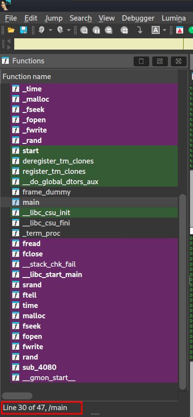{ width=25% }

Zranitelná funkce je funkce ```main```. Ve které se nachází loop který za pomocí instrukcí ```xor```, ```add ``` a ```rol``` postupně převede vstupni data do zašifrovaného formátu.

{ width=60% }

Zranitelné místo je celé v jednom loopu, tudiz je místo obsazeno ve výsledcích z první fáze. Místo je také zároveň obsaženo i ve výsledcích z fáze druhé. Ve výsledcích z druhé fáze je že obsazeno více míst, které s enkrypci dat nemají nic společného. 

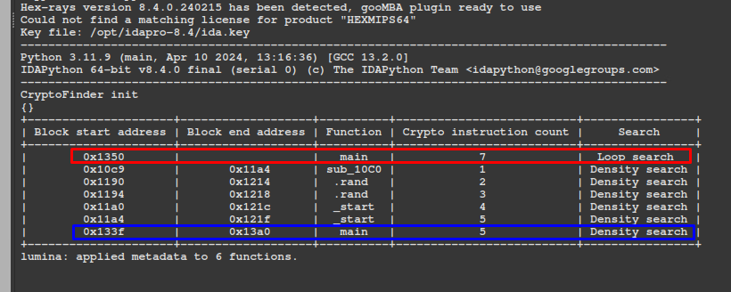{ width=60% }

Odkaz na kompletní vyřešení úlohy lze najít [zde](https://medium.com/@southbre/hackthebox-simple-encryptor-308949f7023c)

### Uloha cislo 2

V této úloze je v binárním souboru celkem 53 funkcí.

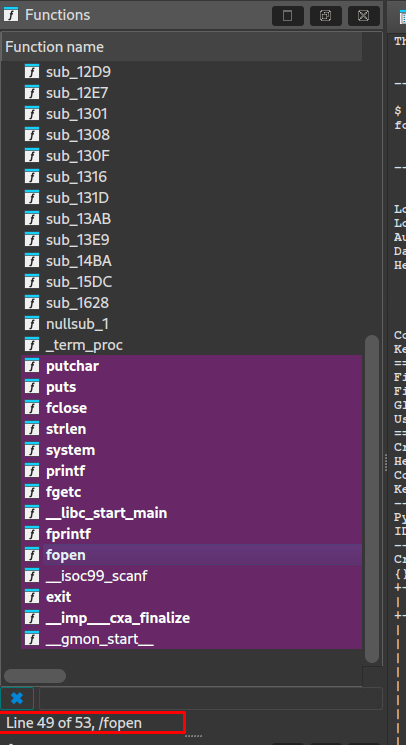{ width=30% }

Funkce ```main``` načte uživatelem zadaný string, následně na něm pomocí několika hlavnich funkcí provede více operací. Každý znak v zadaném stringu převede do binární formy, provede bit shift a nakonec použije substituční šifru na tyto jednotlivé znaky ze stringu.

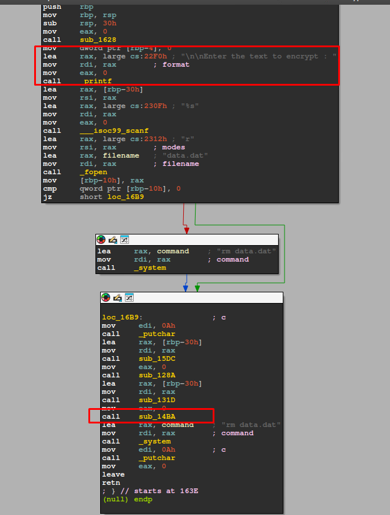{ width=50% }

Hlavní zranitelná funkce je ```sub_14BA```. Tato funkce provede výše uvedené operace, k tomu mimo jiné použije také funkci ```sub_11D9```. Část této funkce s adresami z výsledků ke k vidění na screenshotu níže:

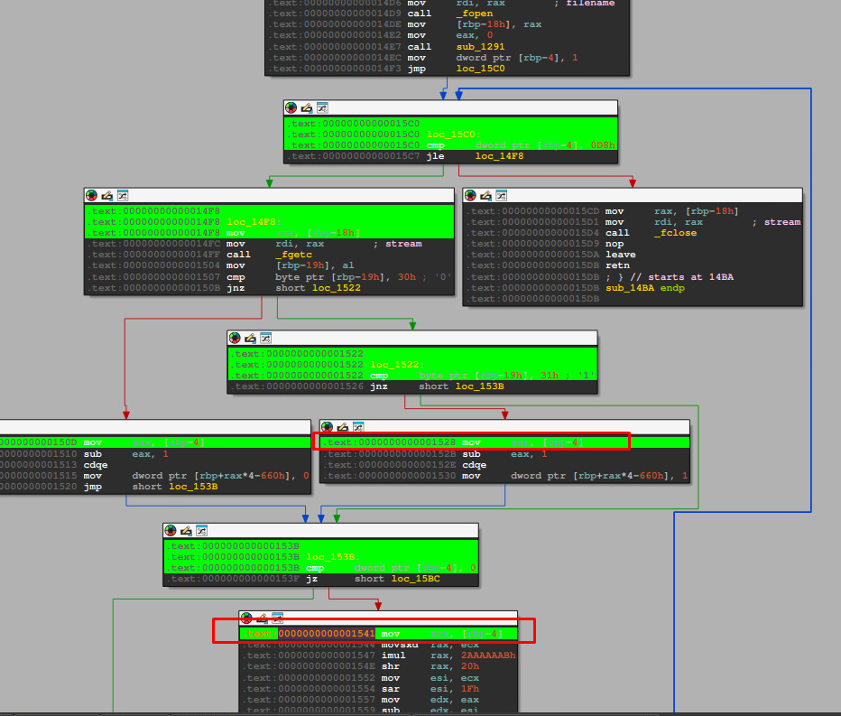{ width=70% }

Zranitelné místo je opět celé v několikanásobném loopu (v obou funkcích), tudíž je obsaženo ve výsledcích z první fáze. Zároveň jsou také obsaženy i výsledcích z druhé fáze. Tentokrát jsou zde obsaženy dvakrát. Opět se ve výsledcích obevuji i jiné, nerelevantní funkce, jak už z načtených standartnich knihoven či funkcích v binárním souboru.

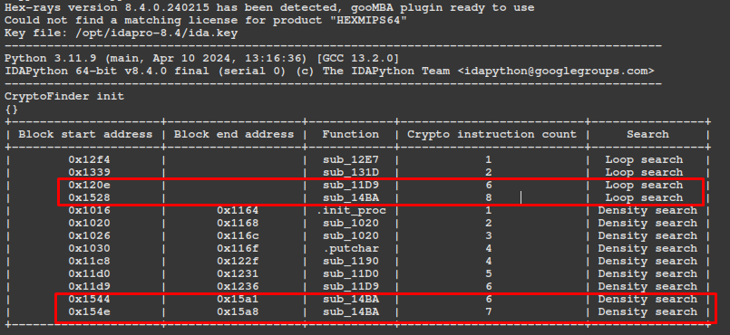{ width=60% }

Odkaz na kompletní vyřešení úlohy lze najít [zde](https://github.com/khirobenn/Encryption-Bot-solution/blob/main/steps.txt)

### Uloha cislo 3

V této úloze je v binárním souboru celkem 708 funkcí. Tento binární soubor je jako jediný specifický tím, že byl kompilovaný z rust kódu.

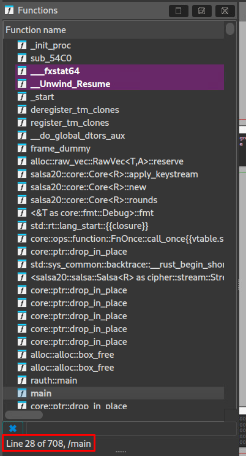{ width=25% }

Struktura funkce ```Main``` je v tomto případě velmi komplikovana, nicméně hlavním cílem úlohy je odhalit funkci ```salsa20``` která využívá stejnojmenou [sifru](https://filipedeluna.medium.com/htb-rauth-reversing-write-up-5f7b7393a1a7) u nichž se v kódu také nachází její klíč ve formě tabulky. Díky tomuto lze úlohu vyresit.

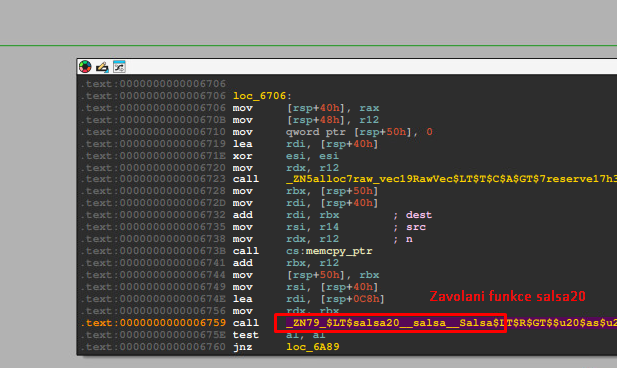{ width=70% }

Ve výsledcích se opět tato funkce (```salsa20```) vyskytuje několikrát, nicméně pouze ve výsledcích z druhé fáze, díky její délce. V První fázi tato funkce nebyla nalezena. Ve vysledcich se také objevuje tentokrát veliké množství funkcí ze standardnich knihoven Rustu. Funkce která je ve výsledcích také zajímavá je funkce kterou Rust používá pro dekompresi dat. V této funkci byla v první fázi nalezena největší frekvence námi hledaných instrukcí. 

{ width=60% }

Program tedy ze 708 funkci zredukoval na potencionální manuální procházení cca 20 funkci s největší frekvencí námi hledaných instrukcí.

Odkaz na kompletní vyřešení úlohy lze najít [zde](https://filipedeluna.medium.com/htb-rauth-reversing-write-up-5f7b7393a1a7)

### Uloha cislo 4

V této úloze je v binárním souboru celkem 111 funkcí.

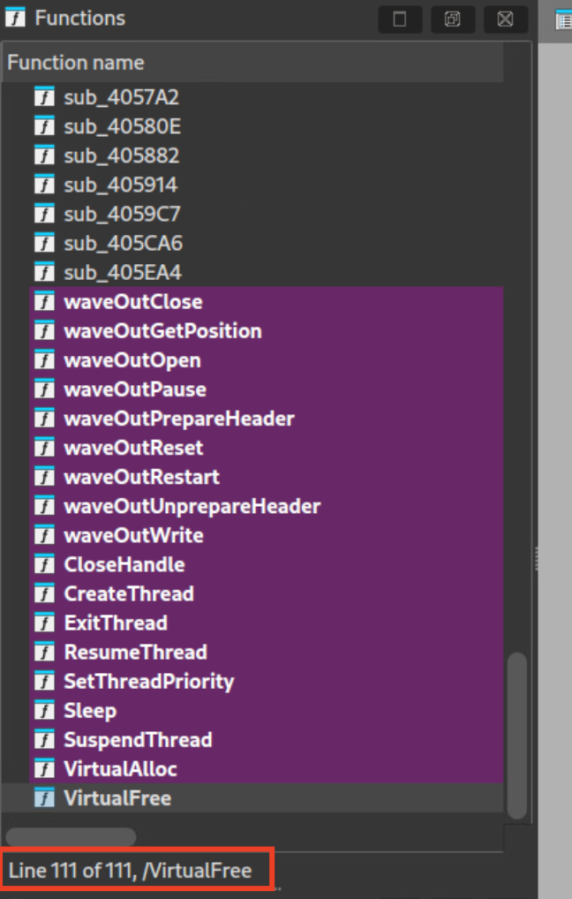{ width=25% }

Opět je zde načten string ze standartniho inputu, je zašifrován a porovnán s jiným stringem. Tato enkrypce je provedena funkci ```sub_402A26```. 

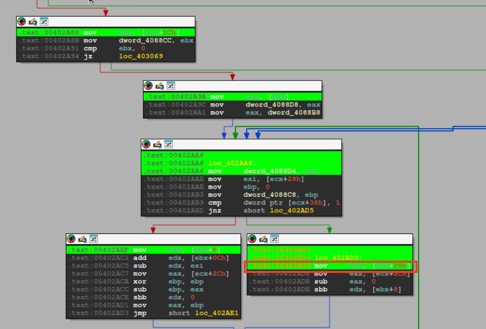{ width=70% }

Tato funkce v sobě obsahuje několik cyklů a tudíž byla nalezena v první fáze. Ve výsledcích z druhé fáze se vyskytuje několikrát. Nyní si můžeme všimnout že i když je tato funkce ve výsledcích z první fáze první, mnoho funkcí s vysokým počtem "kryptografických instrukcí" se v tabulce vyskytuje take.

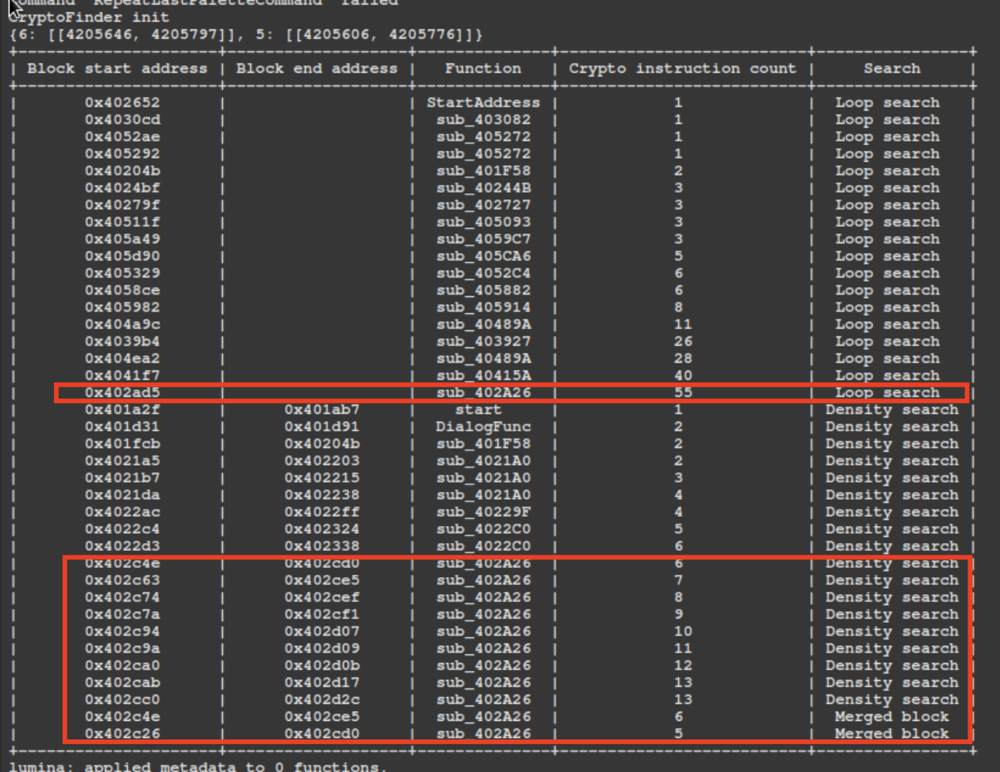{ width=60% }

Odkaz na kompletní vyřešení úlohy lze najít [zde](https://crackmes.one/crackme/5ab77f5b33c5d40ad448c5c6)

### Uloha cislo 5

V této úloze je v binárním souboru celkem 2733 funkcí.

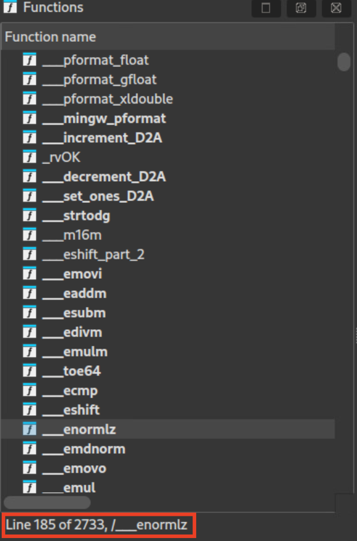{ width=25% }

V této úloze je ve funkci ```main``` je zavolána funkce ```checkFlag```, která obsahuje pouze 4 větvení. Všechny 4 větve na string z user inputu zavolají funkci ```Z2spRKSsz``` která je zodpovědná za jeho enkrypci.

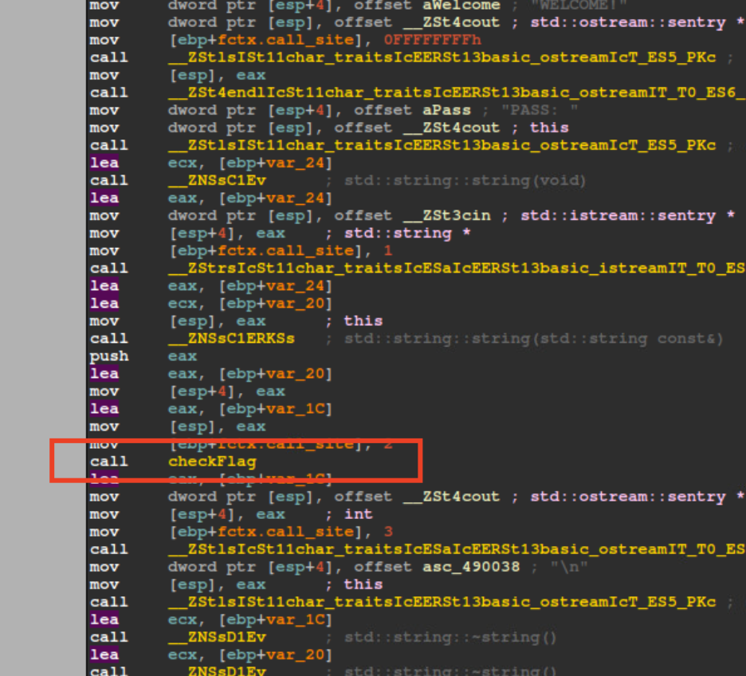{ width=60% }

Nicméně tato funkce provede enkrypci tak že parametry předává mezi různými c++ šablonami s integer streamy a velkým počtem funkcí ze standartnich knihoven. Toto má za důsledek to, že takřka žádné námi hledané "kryprograficke instrukce" se v ní nevyskytují a jsou ve velkých počtech nalezeny v těchto funkcích, jak je vidět ve výsledcích níže. Lze z nich poté nazpět provést analýzu jak se k nim user input dostává, nicméně opačným způsobem (analyzování od počátku funkce main) by bylo mnohem rychlejší.

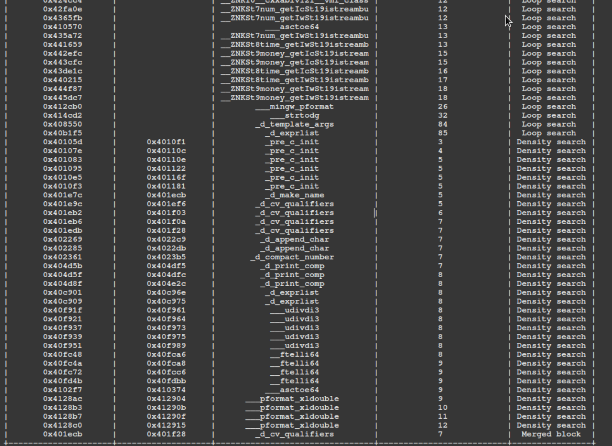{ width=60% }

Odkaz na kompletní vyřešení úlohy lze najít [zde](https://crackmes.one/crackme/6543e9b60f4238b24302b3d2)

### Uloha cislo 6

V této úloze je v binárním souboru celkem 83 funkcí.

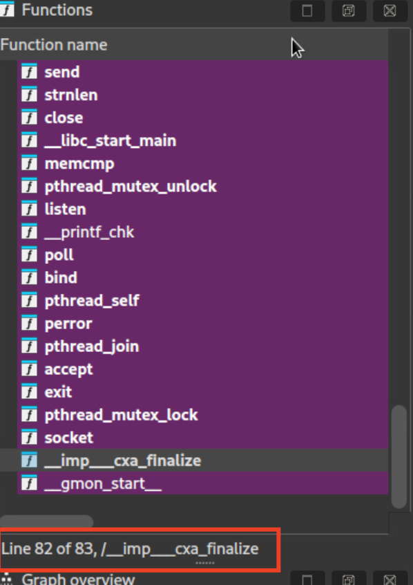{ width=25% }

Tato úloha je specifická tím že běží ve více vláknech a vstup je do ní předáván přes síťové funkce ```recv()``` a ```send()```. Z těchto funkcí je postupně input načítan, ukládán do paměti a upravován instrukcemi ```xor``` a ```add```. Hlavní funkce zodpovědná za toto čtení je ```sub_1720```.

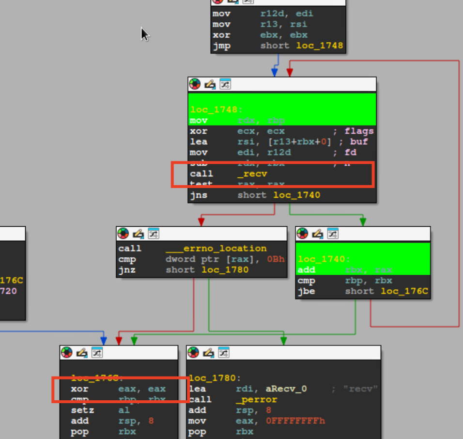{ width=50% }

Tato funkce byla programem nalezena v obou fázích. Byla také nalezena funkce ```sub_16B0``` která je zodpovědná za opačnou operaci - dekódování dat z paměti a posílání uživateli pomocí ```send()```.

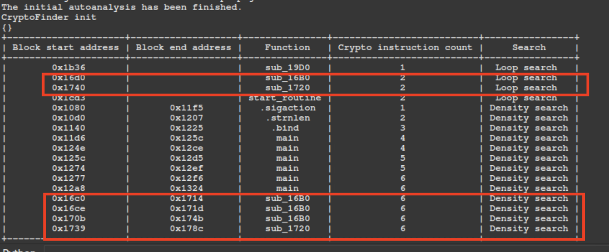{ width=60% }

Odkaz na kompletní vyřešení úlohy lze najít [zde](https://crackmes.one/crackme/60d8d7bd33c5d410b8843087)

### Uloha cislo 7

V této úloze je v binárním souboru celkem 74 funkcí.

{ width=25% }

Tato úloha obsahuje funkci ```decipher()``` která šifruje data. Úkol této úlohy je pouze obrátít co tato funkce dělá. Tato funkce obsahuje pouze jeden blok, ve kterém jse postupně několikrát procházeno přes všechny charaktery ve stringu a pomocí levých a pravých shift instrukcí a ```xor```, je string převeden na "zašifrovanou" verzi. Tato funkce je velmi dlouhá a obsahuje velký počet těchto instrukcí.

{ width=40% }

Toto se samozřejmě promítlo i ve výsledcích, kde je tato funkce obsažené společně s frekvencí 3564 z druhé fáze. První fáze zde podle očekávání moc nenašla. V tomto binárním souboru se také vyskytovali funkce pro převod z šestnáctkové soustavy. Těchto funkcí si také můžeme ve výsledcích z druhé fáze několikrát povšimnout.

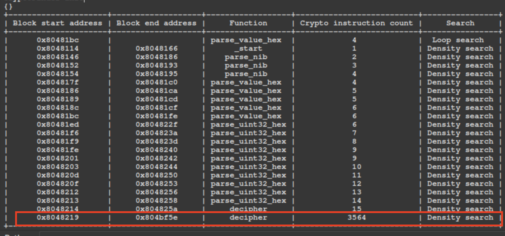{ width=60% }

Odkaz na kompletní vyřešení úlohy lze najít [zde](https://crackmes.one/crackme/5d07f03233c5d41c6d56e10c)

### Uloha cislo 8

Tato úloha je velice specifická a obtížná. Zvolil jsem ji pro testování z důvodu demonstrace jak komplexní tato problematika může bůt a také pro ukázku že pro každý projekt (reverse engineering binárního souboru), který bude něčím specificky by se tento program musel buď upravit a nebo není použitelný vůbec.

Nejen že tato úloha obsahuje několik anti-debugging opatření takže hned po otevření toho souboru IDA Pro nenalezne žádné funkce a musi se nejdrive dekompilovany kód analyzovat manuálně a trošku poupravit. Po odstranění těchto problémů je zde implementována šifra AES pomocí její vlastní instrukční sady, popis této sady je k nalezení [zde](https://en.wikipedia.org/wiki/AES_instruction_set).

{ width=70% }

Nejen že tudiz IDA Pro Api nevrátí žádné funkce k analyzování, i kdyby vrátila, nejsou zde použití žádné z našich "kryptografických instrukcí". Výsledky vrácené naším programem jsou v tomto případě prázdné.

{ width=60% }

Odkaz na kompletní (a velmi detailní v tomto případě) vyřešení úlohy lze najít [zde](https://nofix.re/posts/2023-29-08-barbhack2023-encrypted_box.markdown/)

## Vytvareni dokumentace

Celé tato dokumentace byla vytvořena v Markdownu a převedena pomocí knihovny [Pandoc](https://pandoc.org/) na pdf. Markdown soubor se nachází ve stejné složce v tomto repozitáři. Knihovna Pandoc k tomuto převedení používá latex. Příkaz společně s konfigurací která byla použita:

```bash
pandoc ./code_documentation.md -o ./code_documentation.pdf --from markdown+yaml_metadata_block+raw_html --template eisvogel --table-of-contents --toc-depth 6 --number-sections --top-level-division=chapter --highlight-style breezedark --resource-path=.:src -H disablefloat.tex -V colorlinks=true -V fontsize=11pt
```

kde soubor ```disablefloat.tex``` byl použit k předání nastavení do latexu pro barvy, font a popis obrázku.

```latex
\usepackage{float}
\let\origfigure\figure
\let\endorigfigure\endfigure
\renewenvironment{figure}[1][2] {
    \expandafter\origfigure\expandafter[H]
} {
    \endorigfigure
}
\definecolor{bgcolor}{HTML}{E0E0E0}
\let\oldtexttt\texttt

\renewcommand{\texttt}[1]{
  \colorbox{bgcolor}{\oldtexttt{#1}}
}
```

## Diskuze/Zaver

Tato kapitola pojednává o celkovém zhodnocení provedení programu a jeho výsledků.

V první část algoritmu používající Tarjanuv algoritmus má časovou náročnost rovnou součtu Vrcholů a Hran Procházeného grafu (```O(V + E)```). Tato složitost není ničím limitují a i pro větší funkce, například ty ze standardnich knihoven běží bez problémů. 

Druhá fáze algoritmu pouze sekvenčně prohledává celou (```.text``` část) virtuální paměť načteného binarniho souboru čili je její složitost ```O(N)```, kde N značí velikost tohoto segmentu v paměti (nebo také počet instrukcí který binární soubor má, chcete-li).

Třetí fáze provádí několikrát vnořený cyklus přes nalezené výsledky. Ačkoliv analyzované binární soubory byly dostatečně malé, toto problém zatím nebyl. Pro analyzování větších souborů s počtem funkcí v řádu tisíců, kde se bude vyskytovat hodně cyklu už by tato poslední čast výrazně zpomalovala celý program. Filtrovani výsledku, jak už hledání duplikátních bloku či jejich následovně spojování bude potřebovat do budoucna vylepšit. 

Testování na jednotlivých úlohách přineslo podle očekávání smíšené výsledky, ukazující komplexitu řešeného problému. Pro algoritmy které k operacím na vstupních datech pouzivaji námi hledané "kryptoraficke instrukce", jak už zranitelné šifrovací algoritmy nebo algoritmy použité ke kódování či kompresi jsou tímto programem detekovany. Troufám si říci že cíl programu, redukovat množství funkcí k manuální analýze k nalezení techto algoritmu v binárním souboru byl splněn. 

Při analyzování binárních souborů jiné architektury by se seznam hledaných instrukcí musel upravit. V některých případech by byla nutná prvotní analýza binárního souboru. Pokud binární soubor využívá k enkrypci dat velmi specifické instrukce jejich detekce by musela opět proběhnout manuálně. Toto přináší další část na vylepšení tohoto programu - shromáždit seznam takovýchto instrukci (alespoň nejpopulárnější z nich) v některých architekturách a detekci provádět i s nimi. 

Takřka ve všech výsledcích jsme si mohli povšimnout že program nalezne velké mnozsti nerelevantich funkcí v binárním programu. Velké množství instrukcí z našeho seznamu je použito ke standartni funkcionalitě i v běžných funkcích které nemají s algoritmy které se tento program snaží detekovat nic společného. 

Také jsme si mohli všimnou že některé funkce měli ve výsledcích obsaženo více bloků. Oba tyto problémy by do budoucna mohli být vyřešeny vyladěním algoritmu v třetí fázi, kde by mohli být nadále vyfiltrovany.